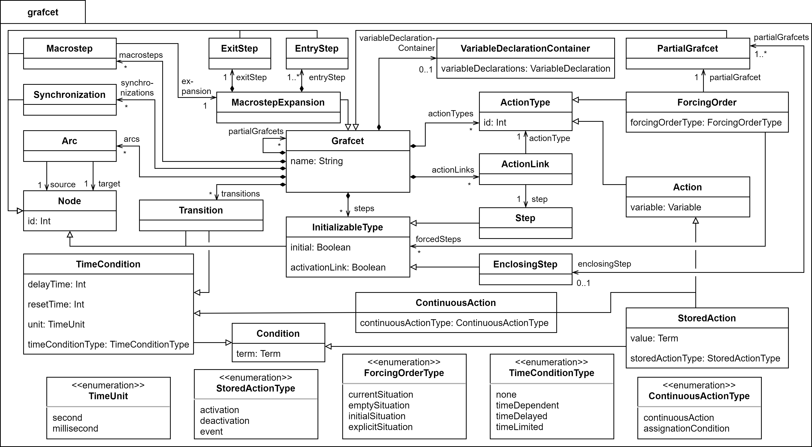

# GRAFCET-metamodel
A detailed metamodel for IEC 60848 GRAFCET

## Implementation
The metamodel includes two packages:
* *grafcet* includes the main objects introduced by IEC 60848 and was originally proposed by Julius et al. [1]
* *terms* includes objects to model terms in a recursive manner, based on [2]

The meta-models are implemented as .ecore-files. This allows a model-driven development of Java-classes using the [*Eclipse Modeling Framework*](https://www.eclipse.org/modeling/emf/ "*Eclipse Modeling Framework*").

## Visual documentation
| | 
|:--:|
| Visual representation of the *grafcet* package |

| | 
|:--:|
| Visual representation of the *terms* package |

## How to cite
*tbd*

## References
[1] R. Julius, T. Trenner, A. Fay, J. Neidig and X. L. Hoang, "A meta-model based environment for GRAFCET specifications," 2019 IEEE International Systems Conference (SysCon), 2019, pp. 1-7, doi: [10.1109/SYSCON.2019.8836959](https://doi.org/10.1109/SYSCON.2019.8836959)

[2] ISO/IEC 15909-2, "Systems and software engineering - High-level Petri nets - Part
2: Transfer format," International Organization for Standardization and
International Electrotechnical Commission, 2011